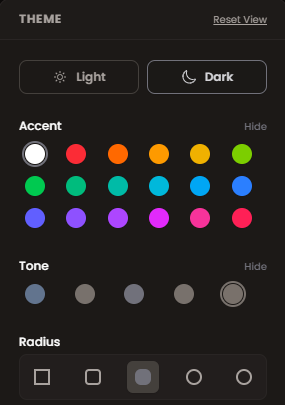

# Lumo Dashboard
### Premium Admin Template built with **Junno UI**

<p align="center">
  
</p>

---

## ✨ Overview

**Lumo Dashboard** is a next-generation admin template designed for speed, flexibility, and aesthetics. Built on the robust **Junno UI** system, it utilizes **Vue 3**, **Nuxt 3**, and **Tailwind CSS** to deliver a developer experience that is as premium as the user interface.

Whether you are building a complex SaaS platform or a simple internal tool, Lumo provides the architectural elegance you need.

> [!TIP]
> **Static & Fast**: Lumo is a pure frontend template. It relies on static TypeScript data sources (`src/data/`), making it easy to deploy anywhere (Vercel, Netlify, Github Pages) without backend dependencies.

---

## 🎨 Advanced Theme Engine

Lumo features a powerful, built-in **Theme Picker** that gives you total control over the look and feel.

<p align="center">
  
</p>

### Customization Features
- **🖌️ Smart Color System**: Choose from a wide array of **Accent** and **Interface Tone** colors. The palette collapses intelligently to keep your UI clean.
- **🔳 Visual Radius Control**: Instantly switch the "vibe" of your app. Go from **Square** (Professional) to **Rounded** (Playful) with a simple click.
- **🌗 Seamless Dark Mode**: Every component is optimized for both Light and Dark environments.

---

## 🛠 Tech Stack

Built with the best modern web technologies:

| Core | Tools |
| :--- | :--- |
|  |  |
|  |  |
|  |  |
|  |  |

---

## 🚀 Key Features

- **⚡ Blazing Fast**: Powered by Vite and Nuxt 3 for instant HMR and builds.
- **📱 Fully Responsive**: Fluid layouts that adapt perfectly to Mobile, Tablet, and Desktop.
- **🧩 Modular Architecture**: 50+ Reusable components built with the Junno UI philosophy.
- **💎 Glassmorphism**: Subtle glass effects and modern blurs for a "Lumo" glow.
- **📊 Interactive Data**: Pre-configured charts (ApexCharts / Chart.js ready) and data tables.

---

## 📸 visual Tour

### Dashboard Overview


<div align="center">
  <table>
    <tr>
      <td width="50%" align="center">
        <b>🔐 Secure Login</b><br><br>
        
      </td>
      <td width="50%" align="center">
        <b>📝 Smooth Registration</b><br><br>
        
      </td>
    </tr>
  </table>
</div>

---

## 🏁 Getting Started

Launch your next project in minutes.

### 1. Install Dependencies
```bash
npm install
```

### 2. Run Development Server
```bash
npm run dev
```
Access the dashboard at **[http://localhost:3000](http://localhost:3000)**.

### 3. Build for Production
```bash
npm run build
```

---

## 📂 Project Structure

Organized for scalability:

```bash
├── src/
│   ├── components/       # Junno UI Components (Global & Views)
│   ├── composables/      # Theme logic (useBrand, useRadius)
│   ├── data/             # Static Data Sources (Mock API)
│   ├── layouts/          # App Layouts (Sidebar, Auth)
│   ├── pages/            # File-based Routing
│   └── app.vue           # Root Component
├── public/               # Assets & Images
└── nuxt.config.ts        # Configuration
```

---

## ⚖️ License

**Lumo Dashboard** © 2026.
Designed and Developed with **Junno UI**.

Licensed for personal and commercial use. 
*Redistribution of this project as a competing template/product is strictly prohibited.*
