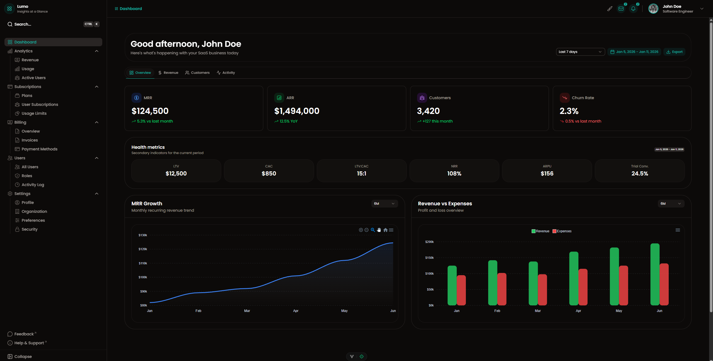
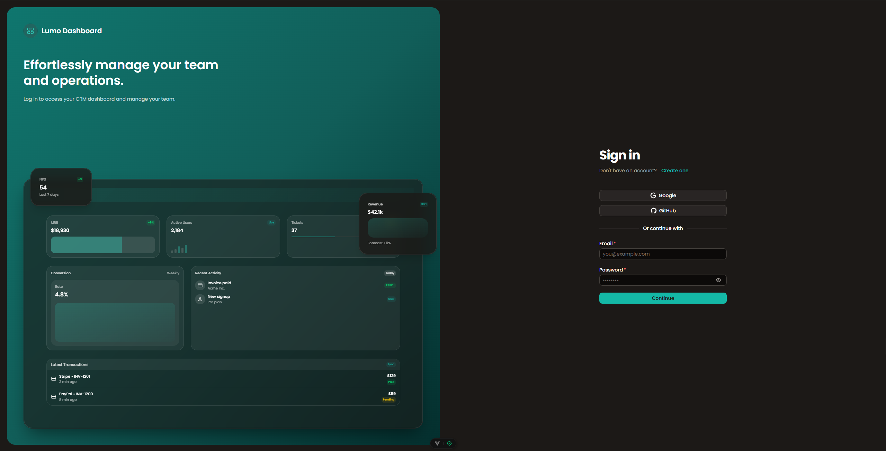
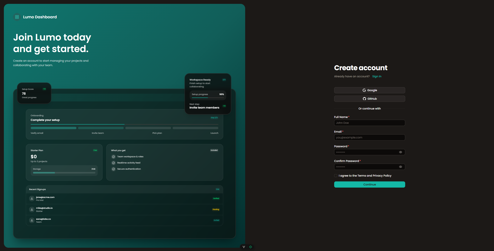

# Junno UI – Premium Nuxt UI Dashboard Template

<p align="center">
  
</p>

---

## ✨ Overview

**Junno UI** is a premium, clean, and modern dashboard template built with **Vue.js**, **Nuxt 3**, and **Nuxt UI**. It is designed to feel high-end, extremely fast, and developer-friendly. Whether you are building a SaaS, a CRM, or an internal admin tool, Junno UI provides the perfect foundation.

> [!NOTE]
> **100% Static & Flexible**: This is a pure frontend template. No backend, API, or database is required. All data is managed via simple TypeScript files in `src/data/`.

---

## 📸 Preview & Screenshots

### Main Dashboard


<div align="center">
  <table>
    <tr>
      <td width="50%">
        <p align="center"><b>Sign In Page</b></p>
        
      </td>
      <td width="50%">
        <p align="center"><b>Register Page</b></p>
        
      </td>
    </tr>
  </table>
</div>

---

## 🛠 Tech Stack

Junno UI is built with the most modern and high-performance web technologies:

| Category | Technology |
| :--- | :--- |
| **Framework** |  |
| **Library** |  |
| **UI Kit** |  |
| **Styling** |  |
| **Language** |  |
| **Icons** |  |

---

## 🚀 Key Features

- **Built-in Dark Mode**: Seamlessly switches between light and dark themes using Nuxt UI's color system.
- **Responsive Design**: Optimized for everything from small mobiles to large 4K monitors.
- **Modular Components**: Over 50+ reusable components (Stats, Charts, Tables, Forms).
- **Glassmorphism Effects**: Modern, semi-transparent UI elements for a premium feel.
- **Pure Static Data**: Easy to prototype and present without worrying about backend logic.

---

## 📂 Project Structure

```bash
├── src/
│   ├── components/       # Reusable UI components & Layout parts
│   ├── data/             # Your static data (Edit this to change UI content)
│   ├── layouts/          # Dashboard & Auth layouts
│   ├── pages/            # Application routes
│   └── app.vue           # Entry point
├── public/               # Static assets (images, icons)
├── nuxt.config.ts        # Nuxt ecosystem configuration
└── package.json          # Project scripts and dependencies
```

---

## 🏁 Getting Started

Get your dashboard up and running in less than 2 minutes.

### 1. Installation
```bash
npm install
```

### 2. Launch Development
```bash
npm run dev
```
Open **[http://localhost:5173](http://localhost:5173)** in your browser.

### 3. Build for Production
```bash
npm run build
```

---

## ⚙️ How to Customize

Updating the dashboard content is incredibly easy. **No coding knowledge for logic is required.**

1.  **Change Data**: Navigate to `src/data/`. Open any file (e.g., `dashboard.ts`).
2.  **Edit Values**: Update names, numbers, or chart labels.
3.  **Real-time Update**: The dashboard updates instantly without any complex API setup.

---

## ⚖️ Copyright & License

**Junno UI – Premium Nuxt UI Dashboard Template**
© 2026 Junno UI. All rights reserved.

Licensed for use in personal and commercial projects. Redistribution or resale of the source code as a template is strictly prohibited.
